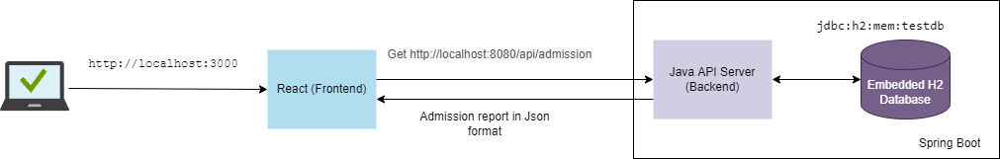
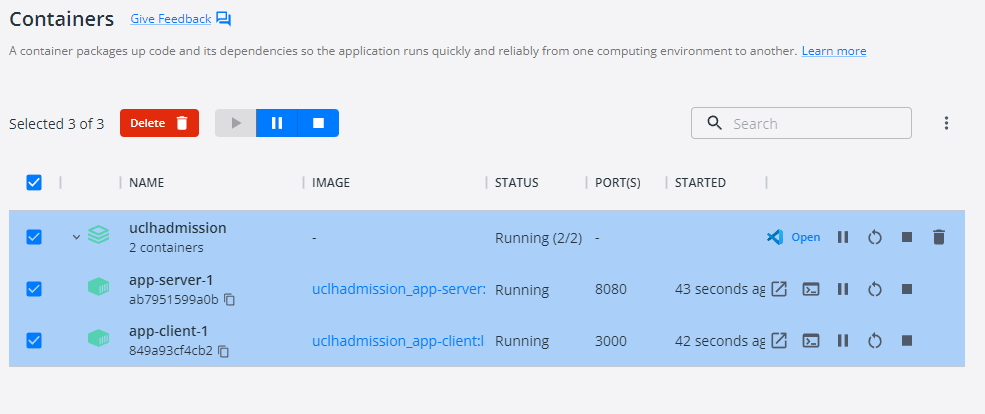

# UCLH Admission Technical Test Overview

--------------
### Overview
Thank you for inviting me to do this technical assignment.
I enjoy it very much because it provides flexibility to explore different technologies to complete it.

--------------

### System Architecture
This project has 3 tier architecture .frontend, backend and database.

I use React for the Frontend, Java Springboot for the backend and embedded H2 database in spring boot.
Both sides adopt docker for deployment. The following chart describes the whole application architecture overview.

In this project, I adopt docker-compose for quick deployment. 2 docker images and containers will be generated by docker-compose

--------------
###Choose & Design

####Frontend :
I choose ReactJs because the learning curve is low and popular.
This is my first time writing ReactJs and I spent about 1-2 days learning and building up react frontend.

The most exciting thing for me is how to design a user-friendly UI using the original requirement.
Finally, I decided to add a basic search function(year Of Birth, sex At Birth and ethnicity, isFake)for the user to query the admission

####Backend :
My expertise is Java so I stuck with that. I use spring boot as a backend framework, JPA to Persistence Layer with SQL database.
Junit + Mockito for TDD.

####Database
Embedded H2 database already bundles in spring boot. I think it is perfect for this kind of small/POC project.

--------------

### Run Docker Compose to dockerize and start frontend and backend one off
    docker compose up -d

--------------

### Technical Detail
[Backend](backend/README.md)

[Frontend](frontend/README.md)

