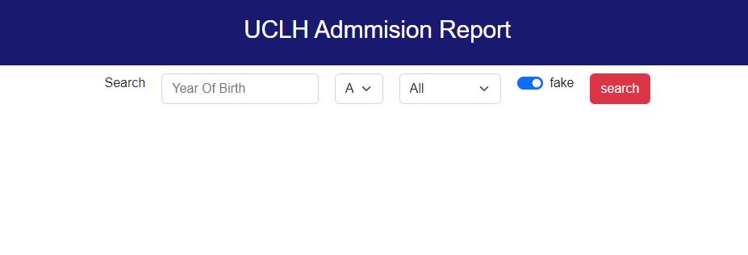
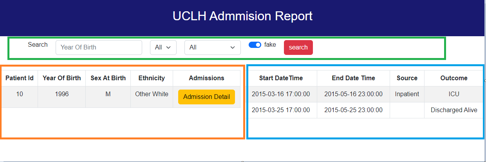

# UCLH Admission Test - Backend

###File structure:
- component : UI component
- constant: constant
- service: API service Call

###How to access the UI
1. BootUp the spring boot for API first
2. go to {ProjectBase}/frontend/
3. run npm start and visit http://localhost:3000

###Docker (frontend standalone):

    docker build --tag=uclh-admission-react:latest .
    docker run -p3000:3000 uclh-admission-react:latest

Intro:
3 sections in UI
Green section - search bar
Orange Section- Patient Info List
Blue Section - Admission List (After clicking Admission Detail in Orange Section)

[Back to overview](../README.md)

